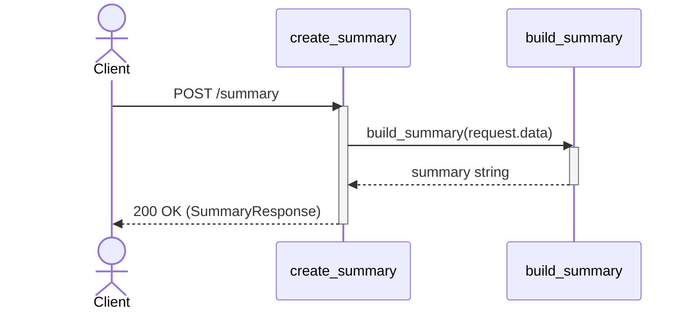
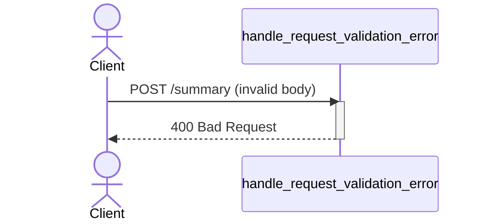

# Data Summary Service

The data summary service provides a human-readable text summary of numerical JSON data.

## Getting Started

Define the port to run the service on:

```bash
export PORT=5000
```

**On Windows (PowerShell):**

```powershell
$env:PORT = 5000
```

Start the service using Docker:

```bash
docker compose up -d
```

Make a request:

```bash
curl -X POST http://localhost:5000/summary \
    -H "Content-Type: application/json" \
    -d '{"data": {"projects": 5, "workspaces": 2}}'
```

## Using the Service

Requests are made by a POST request to the service:

```http
POST /summary
```

### Request Body

The request must be a JSON object where all attributes have non-negative integer values. There can be any number of attributes. For example:

```json
{
    "data": {
        "projects": 5,
        "workspaces": 2
    }
}
```

Strings, nested objects, and arrays are invalid.

### Response Body

**Successful response:**

On successful response, the service will return 200 OK and a string `summary`, for example:

```json
{
    "summary": "There are 5 projects and 2 workspaces."
}
```

If the request is an empty object, then the response will be the following:

```json
{
    "summary": "No data was provided."
}
```

**Error response:**

When the request body is invalid, the service will return a 400 Bad Request Error and the following message:

```json
{
    "message": "Provide a JSON body with a 'data' object containing non-negative integer counts."
}
```

**Example request and response (Python):**

```python
import requests

url = "http://localhost:5000/summary"

payload = {
    "data": {
        "projects": 5,
        "workspaces": 2
    }
}

# Send the request
payload = requests.post(url, json=payload)

# Print the response
print(payload["summary"])
```

## UML Sequence Diagram

**Valid request:**



**Invalid request:**



## Testing

Test are written using pytest, and test make live requests to a running container. If the container is not running or is unhealthy, pytest will exit with an error.

Run tests with the virtual environment:

```bash
# Start the container
docker compose up -d

# Run the tests
.venv/bin/pytest
```
